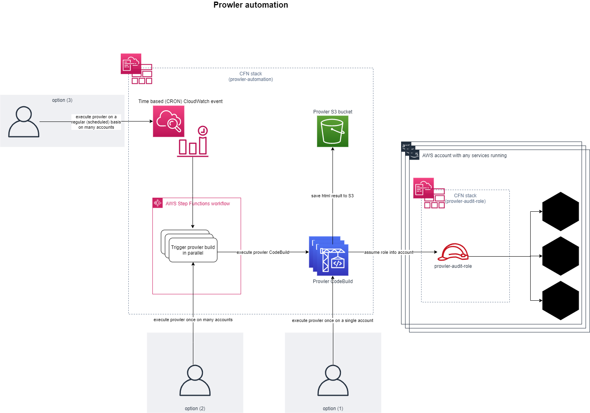
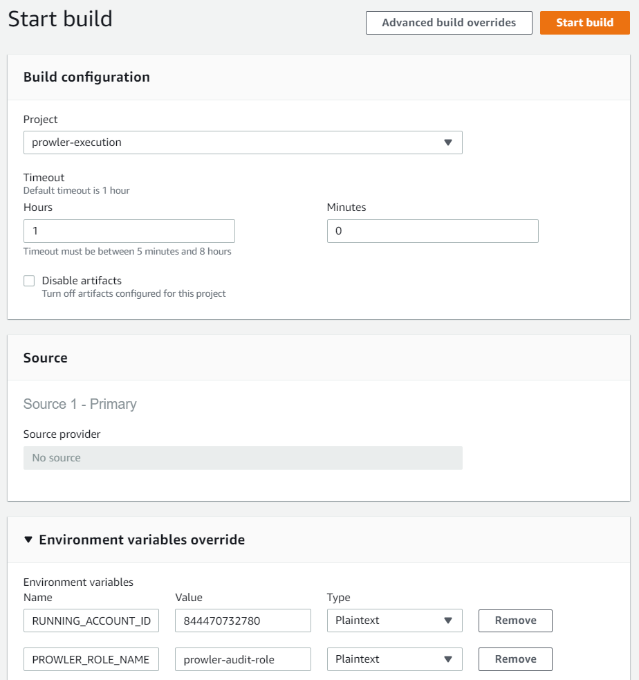

# Introduction

Customers want the possibility to run prowler automated on a regular basis and for many accounts.
Therefore this automation delivers the following features:
* Run Prowler in a docker environment where the EC2 instance will be shut down after run (CodeBuild).
* Run prowler on many accounts in parallel (Step Functions).
* Run prowler on a regular (scheduled) basis (CloudWatch rule).
* Save prowler execution results as html output on a dedicated S3 bucket.

These features will be installed via two CloudFormation stacks:
1. prowler-automation - This stack sets up the automation for running prowler in an AWS account (includes CodeBuild/StepFunctions/CloudWatch rule).
2. prowler-access - Every account where prowler shall scan running resources needs to have this CloudFormation stack installed (includes an IAM role for cross-account access)



# Setup prowler automation

```sh
aws cloudformation package \
  --template-file automation.template.yml \
  --s3-bucket LAMBDA_ARTIFACT_BUCKETNAME \
  --output-template-file .packaged-automation.template.yml \
&& \
aws cloudformation deploy \
  --template-file .packaged-automation.template.yml \
  --capabilities CAPABILITY_NAMED_IAM \
  --stack-name prowler-automation \
  --parameter-overrides \
      ProwlerCrossAccountAuditRoleName=prowler-audit-role \
      DoRunProwlerRegularly=true|false \
      ProwlerRunCronExpression=...

```

Parameters:
* ProwlerCrossAccountAuditRoleName - Name of prowler-audit-role inside accounts to lookup.
* DoRunProwlerRegularly - (value: true|false) Define whether prowler shall be executed via CloudWatch Cron rule on a scheduled basis (true) or manually (false).
* ProwlerRunCronExpression - If _DoRunProwlerRegularly_ is true, then this parameter needs to be set with a [cron expression](https://docs.aws.amazon.com/AmazonCloudWatch/latest/events/ScheduledEvents.html).
  (e.g. "0 12 * * ? *")

# Install prowler role inside account(s)

```sh
aws cloudformation deploy \
  --template-file prowler-access.template.yml \
  --capabilities CAPABILITY_NAMED_IAM \
  --stack-name prowler-access \
  --parameter-overrides \
      AutomationAccountId=123456789012 \
      ProwlerAuditRoleName=prowler-audit-role
```

Parameters:
* AutomationAccountId - Account ID from where prowler will be executed.
* ProwlerAuditRoleName - Name for prowlers audit role. (e.g. 'prowler-audit-role') Needs to be defined as cross-account usage of prowler requires a well known name of IAM role to assume.

# Execution

## via CodeBuild

Execution of a single prowler run can be started via CodeBuild project named _prowler-execution_.

Parameters are:
* RUNNING_ACCOUNT_ID - Default is current account. Can be changed to run prowler inside any account where it's allowed to so. (@see next parameter)
* PROWLER_ROLE_NAME - Default is _prowler-audit-role_. Role name to assume by prowler. It can be either setup in the CodeBuild's account or another via cross-account access. 



## via Step Functions

Step Functions can also be called directly. They feature a parallel execution of prowler instances (via CodeBuild).
The name of the Step Function is _prowler-execution_.

To run the Step Function you need to enter the following input data like this:
```json
{
  "Accounts": [{
    "AccountId": "123456789012"
  }, {
    "AccountId": "999999999999"
  }]
}
 ```


## via CloudWatch Scheduled Event

Execution of a Prowler on a regular (scheduled) basis is also possible. To activate this feature you need to:
1. Define DoRunProwlerRegularly=true on the prowler automation CFN stack
2. Define ProwlerRunCronExpression for the CloudWatch Event rule
3. Go into the CloudWatch event called _prowler-scheduled-execution_ and define the input parameter (Accounts: [...]) as you would do on the Step Function itself.

After that, a CloudWatch Event rule will trigger prowler runs on the defined scheduled basis automatically.


# View results

All prowler results are stored inside a dedicated S3 bucket which is created with the _prowler-automation_ CFN stack.
It is named _prowler-reports-${AWS::AccountId}_

The files prefix structure (folders) is named like this: bucketname/accountid/year/month/day/timestamp_prowler_report.html
e.g.
```
s3://prowler-reports-123456789012/
  999999999999/
    2020/
      04/
        19/
          12-02-06_prowler_report.html
          ...
```

Note: The S3 bucket has `DeletionPolicy: Retain` set, which means, that you need to delete the bucket (and its content) manually after deleting the stack.